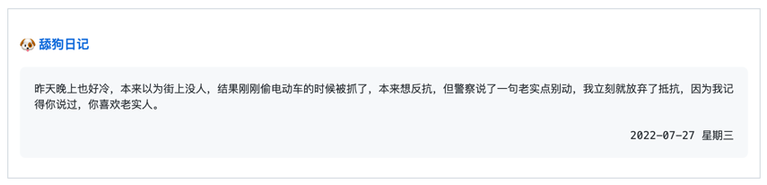

<p align="center">
  
  <h2 align="center">Dog diary Box</h2>
  <p align="center">将今天的《舔狗日记》更新到 Gist / profile README</p>
</p>

---

> 📌✨ 更多像这样的 Pinned Gist 项目请访问：https://github.com/matchai/awesome-pinned-gists

## 🖥 使用

### 🎒 前置工作

1. 创建一个公开的 Github Gist (https://gist.github.com)

2. 创建一个 GitHub Token，需要勾选 `gist` 权限，复制生成的 Token (https://github.com/settings/tokens/new)

3. 如果需要更新到某个`markdown`文件，请在对应文件需要更新的地方添加以下注释

```text
<!-- dog-box start -->
<!-- dog-box end -->
```
### 🚀 安装

1. Fork 这个仓库

2. 进入 Fork 后的仓库，启用 Github Actions

3. 编辑 `.github/workflows/schedule.yml` 文件中的环境变量：

    - **`DOG_GIST_ID`**: `ID` 是新建 `Gist` 的 `url` 后缀: `https://gist.github.com/sunchaser-lilu/`**`e85d2e5765110be1d8cfe57f2557a130`**

    - **`MARKDOWN_FILE`**: 如果更新到某个`markdown`文件，填写`markdown`文件名（包含相对路径或者绝对路径）。
    
    - **`DOG_WIDTH`**: 每行文字字符数。默认`65`。
    
    - **`DOG_FILL_LEN`**: 日期填充对齐字符数。默认`106`，与`DOG_WIDTH`默认`65`对应。

4. 在项目的 `Settings > Secrets` 中创建变量 `GH_TOKEN`，将值设置为前置工作中生成的 `Github Token`

## 🤔 工作原理

- 基于 [花楹API](https://lilu.org.cn/huaying/) & [舔狗日记](https://lilu.org.cn/dog/) 获取每日舔狗日记。
- 基于 Github API 更新 Gist
- 使用 Github Actions 自动更新 Gist

## 📄 开源协议

本项目使用 [Apache-2.0](./LICENSE) 协议
